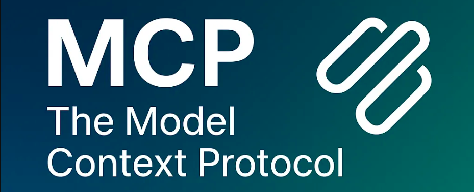
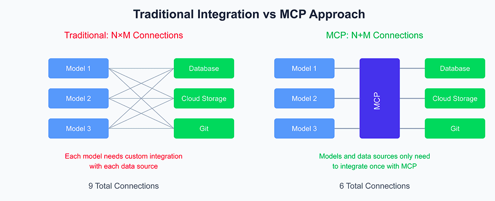

# MCP Experiment: Building Scalable AI Systems with OLLAMA and Qwen3



## Table of Contents

- [Introduction](#introduction)
- [What is MCP?](#what-is-mcp)
- [Project Overview](#project-overview)
- [Features](#features)
- [Prerequisites](#prerequisites)
- [Installation](#installation)
- [Project Structure](#project-structure)
- [Usage](#usage)
  - [Starting the MCP Server](#starting-the-mcp-server)
  - [Running the MCP Client](#running-the-mcp-client)
- [How It Works](#how-it-works)
  - [MCP Server](#mcp-server)
  - [MCP Clients](#mcp-clients)
- [Example Use Cases](#example-use-cases)
- [Troubleshooting](#troubleshooting)
- [Contributing](#contributing)
- [License](#license)

## Introduction

This project demonstrates how to build scalable AI systems using the Model Context Protocol (MCP) with OLLAMA's Qwen3 model. MCP provides a standardized framework for AI models to interact with external tools and data sources, making it easier to build complex, production-ready AI applications.

## What is MCP?

Model Context Protocol (MCP) is an open standard that enables AI models, particularly large language models (LLMs), to interact with external tools, data sources, and systems in a standardized way. It solves the integration complexity that arises when building large-scale AI systems.



## Project Overview

This project includes:

- An MCP server with tools for Python code execution and web content fetching
- Two MCP client implementations demonstrating different use cases
- Integration with OLLAMA's Qwen3 model for local, privacy-first AI processing
- Example scripts for common AI workflows

## Features

- 🔌 **Standardized Integration**: Connect AI models with external tools using MCP
- 🏗️ **Modular Architecture**: Easily add new tools and capabilities
- 🔒 **Privacy-First**: Run everything locally with OLLAMA and Qwen3
- 🚀 **Scalable**: Designed for enterprise-grade deployments
- 🧩 **Extensible**: Add custom tools and integrations as needed

## Prerequisites

- Python 3.8+
- [OLLAMA](https://ollama.com/) installed and running
- Qwen3 model downloaded via OLLAMA
- Required Python packages (see Installation)

## Installation

1. Clone this repository:

   ```bash
   git clone <repository-url>
   cd MCP-Experiment
   ```

2. Install OLLAMA (if not already installed):

   ```bash
   curl -fsSL https://ollama.com/install.sh | sh
   ollama serve
   ```

3. Download the Qwen3 model:

   ```bash
   ollama pull qwen3:4b
   ```

4. Create and activate a virtual environment:

   ```bash
   python -m venv venv
   source venv/bin/activate  # On Windows: venv\Scripts\activate
   ```

5. Install the required Python packages:
   ```bash
   pip install -r requirements.txt
   ```

## Project Structure

```
MCP-Experiment/
├── assets/                    # Images and resources
├── client.py                  # First MCP client implementation
├── client2.py                 # Second MCP client with custom server
├── server.py                  # MCP server implementation
├── requirements.txt           # Python dependencies
└── README.md                 # This file
```

## Usage

### Starting the MCP Server

1. Ensure OLLAMA is running:

   ```bash
   ollama serve
   ```

2. In a new terminal, start the MCP server:

   ```bash
   python server.py
   ```

   The server will start and be available at `http://localhost:8000/mcp`.

### Running the MCP Client

#### Client 1: Web Search Example

```bash
python client.py
```

This client demonstrates how to use MCP to perform web searches and analyze content.

#### Client 2: Custom Server Integration

```bash
python client2.py
```

This client shows how to connect to a custom MCP server and interact with specific tools.

## How It Works

### MCP Server

The MCP server (`server.py`) provides several tools:

1. **execute_python_code**: Executes Python code and returns the output
2. **fetch_web_content**: Fetches content from a given URL
3. **analyze_web_content**: Uses Qwen3 to analyze web content

### MCP Clients

- **client.py**: Demonstrates basic MCP client functionality with web search
- **client2.py**: Shows integration with a custom MCP server

## Example Use Cases

1. **Web Content Analysis**: Extract and summarize information from websites
2. **Code Execution**: Run and test Python code snippets
3. **Data Processing**: Process and analyze data from various sources
4. **Automation**: Automate repetitive tasks using AI-powered tools

## Troubleshooting

1. **OLLAMA not running**:

   ```bash
   # Check if OLLAMA is running
   ollama list

   # If not, start it
   ollama serve
   ```

2. **Missing dependencies**:

   ```bash
   pip install -r requirements.txt
   ```

3. **Port in use**:
   Change the port in `server.py` if port 8000 is already in use.

## Contributing

Contributions are welcome! Please feel free to submit a Pull Request.

## License

This project is licensed under the MIT License - see the [LICENSE](LICENSE) file for details.

---

Created by [Neel Shah] | [Blog Post](https://medium.com/@neeldevenshah/mcp-the-secret-sauce-for-building-scalable-ai-systems-with-ollama-and-qwen3-6ebaaae6bfe3)
